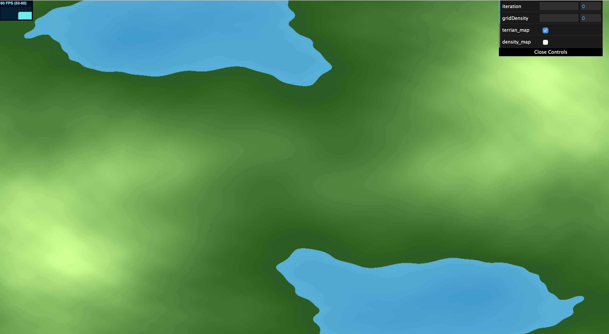
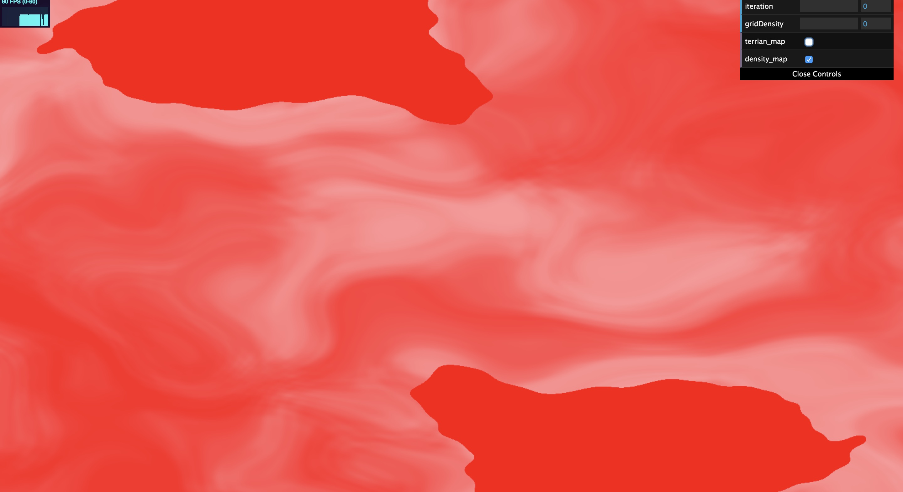
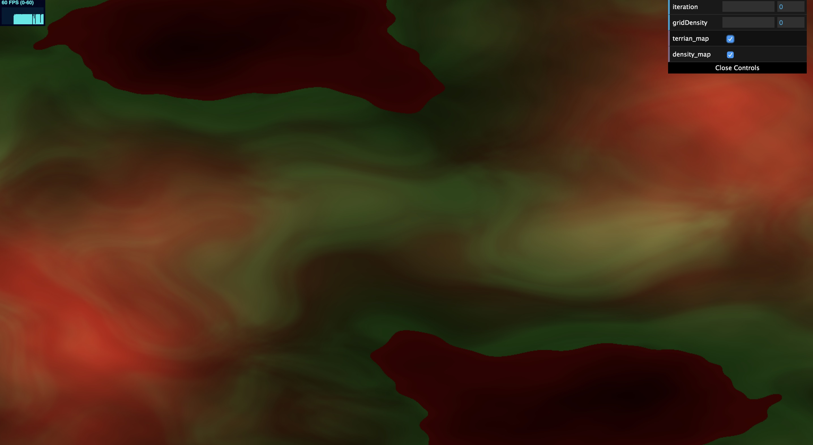
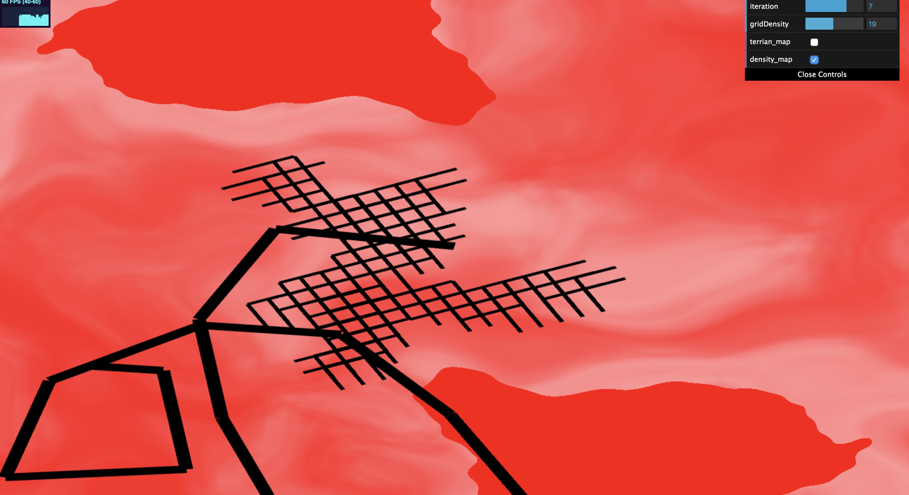
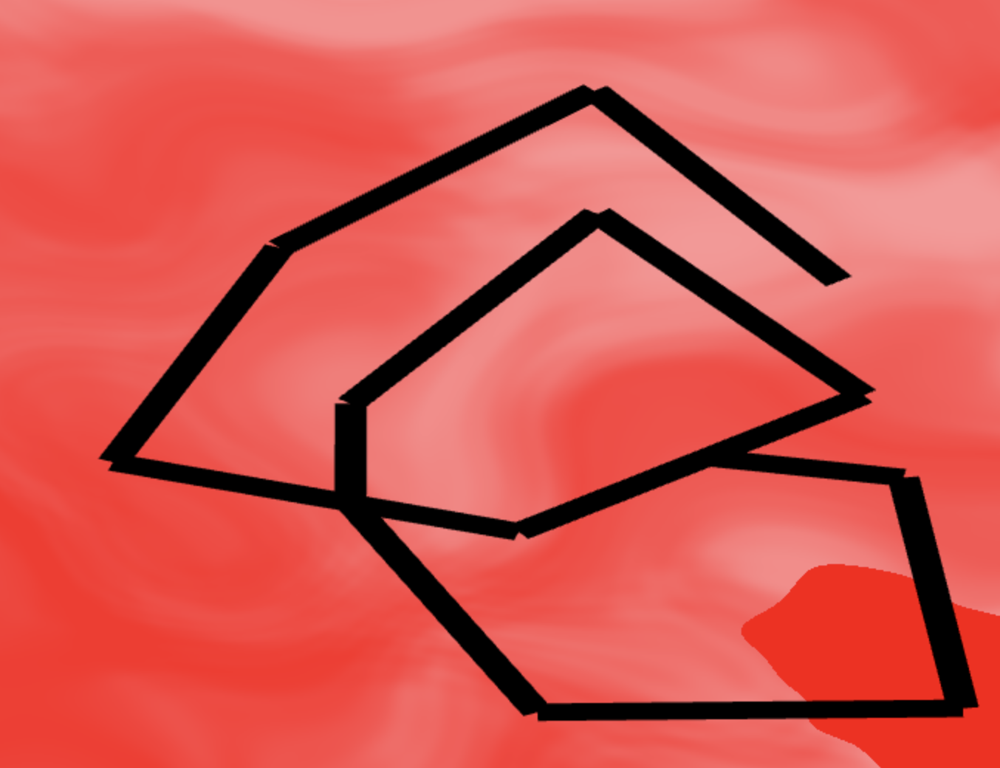
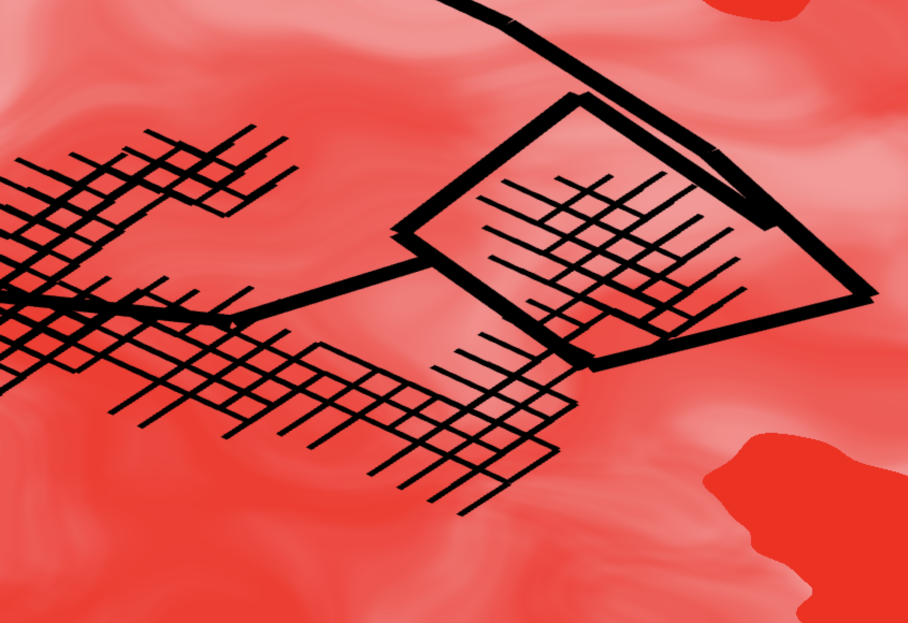

# Homework 5: Road Generation

## Student Information

**Name:** Chianti Yan

**Penn ID:** 85100574

## Demo

The live demo can be checked in this link: 

<https://chiantiyzy.github.io/hw05-road-generation/>

When you first open the demo you will see a blank page. By enable the *terrain_map* you will see as below:

The blue part is the water and the green part is the terrain. The color goes lighter when the latitude grows up.

If you enable the *density_map* you will see as below:

The color goes lighter as density goes higher. In the water part, the density is zero, and the color is pure red. By combining the terrain and density map, you will see something like this:

By changing the highwayDensity and gridDensity, you will get a road map like below: 

Thicker lines represent the highway and thinner lines represent the streets. 

## Geometry Explained

**Highway**

The high way and the street are seperate turtles. The highway turtle branching out by seeking the largest density for the surrounding 8 directions. Intersection is checked such that the highway won't go across one another. By default, if an intersection occurs, the highway will stop at the intersection position and branching to another direction. A closer example is as below: 

**Street**

The streets are branching out using a simple grammar: 

> X = [-G]X[+G]

'G' is going forward if it won't get into water. 

'[' and ']' are pushing and poping.

'+' and '-' are turing right or left.

It only turns in 90 degrees such that the streets will be grid-like. 

Also, the rotation and slope of the streets are related to the highway. Everytime a highway is draw, the street turtle will update its location and orientation to follow the general highway position. An example of the pattern following is as below:

## Limitation

My algorithm still has a lot of limitations.

+ First, since I render the map in GPU and CPU, the data seems not perfectly identical. Therefore, even though I checked density for streets not going to the water, the streets can still go into water area.
+ The street and the highway are not always following the same direction.
+ Since the highway is looking for the highest density, it can sometimes go back to where it comes from and keeps on back and forth.
+ The highway and streets can sometimes go out of the screen. 